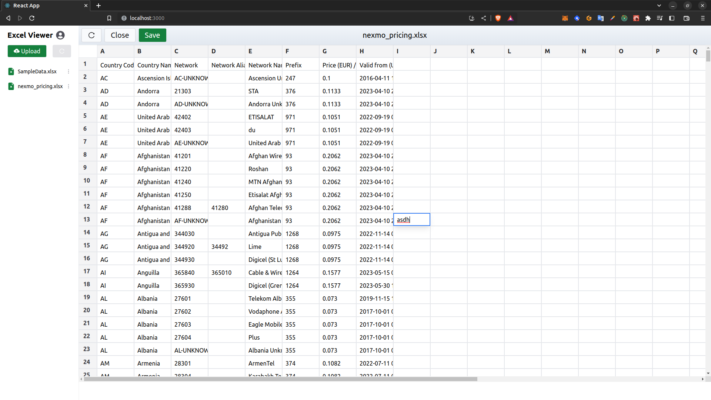

# Basic Excel Viewer
Optimized to import, view, edit and save spreadsheet with large amounts of data.

## Table of content

- [Overview](#overview)
  - [User Story](#user-story)
  - [Screenshot](#screenshot)
  - [Links](#links)
- [Development](#developmment)
  - [Built with](#built-with)
  - [Useful resources](#useful-resources)
- [Author](#author)
- [Acknowledgments](#acknowledgments)

## Overview

### User Story

Users should be able to:
- Create an account.
- Create new XLSX sheets.
- Upload, edit and then save the XLSX files after editing.

### Screenshots

<!-- ###Links LINKS HERE -->

## Development

### Built with

- Frontend - ReactJS and TailwindCSS
- Backend - Nodejs, Express MongoDB
- XLSX Library for parsing XLSX files.
- Tanstack Virtual - for handling large amounts of data
### Useful resources

- [XLSX Docs](https://www.npmjs.com/package/xlsx) - Official documentation for XLSX library.

### Project Setup

- Clone the project
- Run `npm install` in client as well as server folder.
- Add your envs as given in the .env.example file.
- In the root directory, run `npm run start`. It will run your backend and as well as frontend using concurrently.
